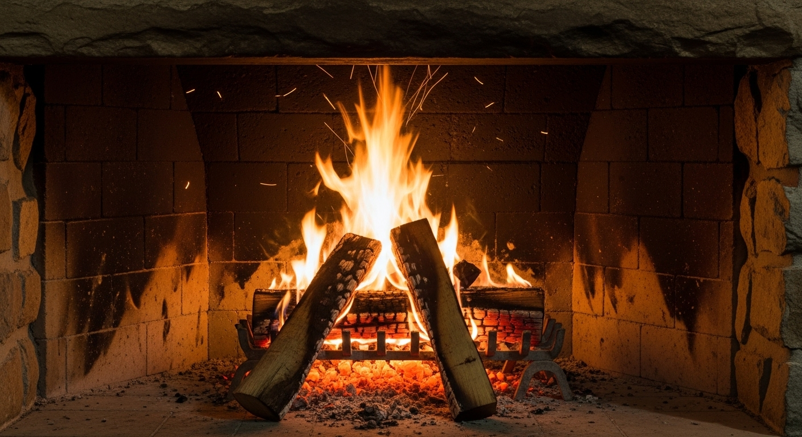

# Simple Tutorial for Vidstr
_August 2, 2025_

We'll create a simple fireplace looped video here. It's not the coolest, but it pretty fool proof and requires a small number of steps.

> **Note**: We'll be using Veo2 in this tutorial since using sophisticated paramaters for video generation is not yet Generally Available for Veo3.

### Setup

First, enable scripting be following the [scripting section](./../README.md#scripting) in the readme. Now you can call vistr in any directory and read/write files there.

Then setup the authentication in the `.env`. For this tutorial you will need **vertex** authentication since it uses the `last_frame` parameter for video generation.

Now create a fresh directory where you'll create and re-use assets:

```bash
mkdir my-first-loop
cd my-first-loop
```

### Setup the workspace

1.) Create some helper files:

```bash
touch gen.sh profile.yaml instruct.img.conf instruct.vid.conf
chmod +x gen.sh
```
These files will:
- `gen.sh` this is were you'll 

2.) Now add starter content to these files:

Into **profile.yaml**

_This will override the settings in the [default config](../config.yaml)._

```yaml
image_generation:
  aspect_ratio: "16:9"
video_generation:
  duration_seconds: 5
  aspect_ratio: "16:9"
```

Into **gen.sh**

_This will be used to run reproducible vidstr commands. Note the top section is utility function we'll copy into each new workspace but are not strictly nec._

```bash
## utility functions ----
run_logged() {
    PYTHONUNBUFFERED=1 stdbuf -oL -eL "$@" 2>&1 | tee -a log.log
}

read_prompt() {
    # remove comments ("#"), line breaks and whitespace 
    local file="$1"
    if [[ ! -f "$file" ]]; then
        echo "Error: File not found: $file" >&2
        return 1
    fi
    grep -v '^\s*#' "$file" | tr '\n' ' ' | sed 's/  */ /g' | sed 's/^ *//;s/ *$//'
}

## intital image choice ----
PROMPT=$(read_prompt instruct.img.conf)
ARGS=(
    main.py
    image
    -n 4
    "$PROMPT"
)
run_logged vidstr "${ARGS[@]}"
```

Into **instruct.img.conf**

_This is where you put the prompt for the inital images you create._

```conf
a fireplace with a medium size fire
```

> **Tip**: You can use multi-line and comments to iterate on your prompts, see the [Appendix](./tutorial-v1.md#appendix) section on this.

### Generate initial images

Since images are 100x cheaper than videos, let's generate some initial images so we can get the best style

Run `./gen.sh` to execute the program which should generate `image-001.png, ... image-004.png` into your current working directory.

The output will look like this:

```bash
Connecting to Gemini API...
Loading profile settings from: /home/user/dev/smol-projs/art-vidstr/pkgs/river.1/profile.yaml
Loading profile settings from: /home/user/dev/smol-projs/art-vidstr/pkgs/river.1/profile.yaml
Generating 4 image(s) for prompt: 'photograph from a boat moving down the river in tropical forest'
Saved image to /home/user/dev/smol-projs/art-vidstr/pkgs/river.1/image-001.png
Saved image to /home/user/dev/smol-projs/art-vidstr/pkgs/river.1/image-002.png
Saved image to /home/user/dev/smol-projs/art-vidstr/pkgs/river.1/image-003.png
Saved image to /home/user/dev/smol-projs/art-vidstr/pkgs/river.1/image-004.png
```
> **Note**: When you run the script a `log.log` file will be created which should contain all the stdout and stderr that your commands produce. This is useful for debugging and referencing and reproducing how you generated the assets

Look through each of these pictures, either create more by running the script again, and/or refining the prompt in `instruct.img.conf` when you have the image that looks like the video you want to create move onto the next step...

> **Tip**: You may want to augment your image generation by setting in `profile.yaml` the image_generation.model parameter to `"imagen-4.0-ultra-generate-preview-06-06"` which is the best model available currently.




### Generate first video

Head back to your **gen.sh** and comment out the generate images functionality and adding the new functionality. Assuming the image you like is image-003.png

```bash
## intital image choice ----
# PROMPT=$(read_prompt instruct.img.2.conf)
# ARGS=(
#     main.py
#     # --vertex
#     image
#     -n 4
#     # -n 1
#     "$PROMPT"
# )
# run_logged vidstr "${ARGS[@]}"

## gen video #1
PROMPT=$(read_prompt instruct.vid.1.conf)
BASE_IMG="image-003.png"
ARGS=(
    main.py
    video
    -i "$BASE_IMG"
    "$PROMPT"
)
run_logged vidstr "${ARGS[@]}"
```

And add a video prompt here (separate from the image prompt) which will include camera directions in addition to the content desired:

**instruct.vid.conf**

```conf
a stationary camera 
with no zoom in and no zoom out 
observes the fire in the fireplace burning
```

_Giving instructions to abstain from camera movement is important here since it make looping easier and smoother._

Now run `./gen.sh` again which should create `video-001.mp4` of 5 seconds (that was set in profile.yaml). It will also appended the operations to `log.log`. 

If the video looks good move onto the next step...


### Generate second video "loopback"

Let's modify the **gen.sh** by commenting out the previous section and running another video creation command `loop-video`.

```bash
## gen video #1
#PROMPT=$(read_prompt instruct.vid.1.conf)
#BASE_IMG="image-003.png"
#ARGS=(
#    main.py
#    video
#    -i "$BASE_IMG"
#    "$PROMPT"
#)
#run_logged vidstr "${ARGS[@]}"
# create loop back off of video001

PROMPT=$(read_prompt instruct.vid.conf)
BASE_VID="video-001.mp4"
ARGS=(
    main.py
    loop-video
    -v "$BASE_VID"
    -p "$PROMPT"
)
run_logged vidstr "${ARGS[@]}"
```

When this runs you'll notice two files are created: `tmp.loop_first_frame-001.png` and `tmp.loop_last_frame-001.png`. These correspond to the first and last frame of the first video are used as targets for this loop back video.

Take a look at this video, if it matches the style of the first video well enough, let's move onto our last step...


> **Tip**: You'll also notice we're using the same prompt file for this video as the original video. That's fine here since there's nothing new we're adding in here but you can change this to assist the loop back. Also we're keeping this video as 5 seconds, but ordinarily the loop back video should be a max duration (8 seconds) to give it the most chance to smoothly transition to desired ending frame.

### Concatenate videos to create infinite loop

Combine the initial video with the loopback to create an infinite loop. We're using `vidstr concat_vid.py` script to do this which uses opencv under the hood.

```bash
# turn to videos into a 2x loop
VID1="video-001.mp4"
VID2="video-002.mp4"
OUTPUT_FN="loop.fireplace-1.mp4"
ARGS=(
    concat_vid.py
    --files "$VID1", "$VID2"
    -o tmp.both.mp4
)
run_logged vidstr "${ARGS[@]}"
ARGS=(
    concat_vid.py
    --files tmp.both.mp4, tmp.both.mp4
    -o "$OUTPUT_FN"
)
run_logged vidstr "${ARGS[@]}"
```

This has now created a 20 second video - `loop-fireplace-1.mp4` of two full loops:
- video-001: (5 sec)
- video-002: (5 sec)
- video-001: (5 sec)
- video-002: (5 sec)

We can inspect this for any transitions that aren't smooth and reproduce videos as nec.

_Congrats if you've made it this far, now cozy up to the fire and ponder what you could create next!_


### Appendix

##### Using .conf files for prompts

Getting the right image often requires iterating on prompts, the best way to have fine control here is to use multiple lines to comment things in and out. However image and video models don't understand multilines and ignoring comments so that's what the `read_prompt` utility function in the gen.sh script does.

Here's an example of one where there was experiment with _what_ the artist wanted and _how_ the artist was requesting to the model to get it.

```conf
# moving shot from inside driving car 
POV drivers seat
at night
no rain
# # rainy night
# # no windshield wipers
# # windshield wipers off
# # no windshield wipers
cruising medium speed
building move by in the background
# vintage sports car
no motion blur
```

When this .conf file is read in by the script, it passes the video generation prompt parameter a single-line prompt with the commented lines removed, in this case:

> POV drivers seat at night no rain cruising medium speed building move by in the background no motion blur

The reason we use `.conf` extension is because it enables the commenting in/out with shortcut keys (VScode), but doesn't run langserver errors for natural language.